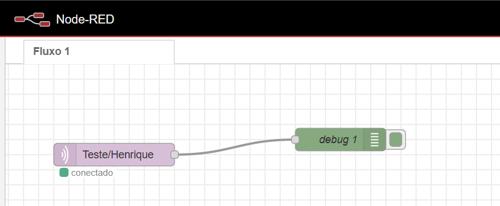

# Projeto IoT - Monitoramento Climático

Descrição do Projeto
Este projeto consiste em um sistema de monitoramento climático utilizando um ESP32, que coleta dados de temperatura, umidade, vento e outros parâmetros climáticos de uma API (OpenWeatherMap). Os dados coletados são enviados para um Broker MQTT, que integra o sistema com o Node-RED para visualização e processamento. Além disso, o sistema controla LEDs (verde, amarelo e vermelho) para indicar o status do clima em tempo real.

## Funcionalidades Principais:
Coleta de dados climáticos: Utiliza a API OpenWeatherMap para obter informações de temperatura, umidade, pressão, vento, entre outras.

Envio de dados via MQTT: Os dados coletados são enviados para um Broker MQTT, permitindo que o Node-RED receba e processe essas informações.

Controle de LEDs: LEDs de diferentes cores são acionados com base nas condições climáticas (verde para "tudo ok", amarelo para "atenção", vermelho para "risco").

Monitoramento e visualização: Utilizando o Node-RED, as informações são visualizadas e podem ser usadas para automatizar respostas.

## Pré-requisitos
Antes de começar, você precisará de:

Conta na API OpenWeatherMap para obter uma chave de API (substitua SUA_CHAVE_API no código).

Node-RED instalado para a integração com o MQTT.

Broker MQTT (ex: Mosquitto ou qualquer outro broker configurado para receber dados).

Extenções no Visual Studio: PlatformIO IDE, Wokwi Simulator.

## Importar Fluxos do Node-RED:

Importe o arquivo flow.json para o Node-RED.

No Node-RED, clique no menu de hambúrguer (no canto superior direito), depois em Import.

Selecione o arquivo flow.json e clique em Import para adicionar os fluxos.

Segue a vizualização do fluxo

Certifique-se de que o nó MQTT in está configurado corretamente para o tópico Teste/Henrique.

Verifique a Visualização:

Após rodar o fluxo, as mensagens enviadas pelo ESP32 aparecerão no painel de debug do Node-RED.

## Integrantes

Henrique Maciel
Gabriela Moguinho
Mariana Christina
